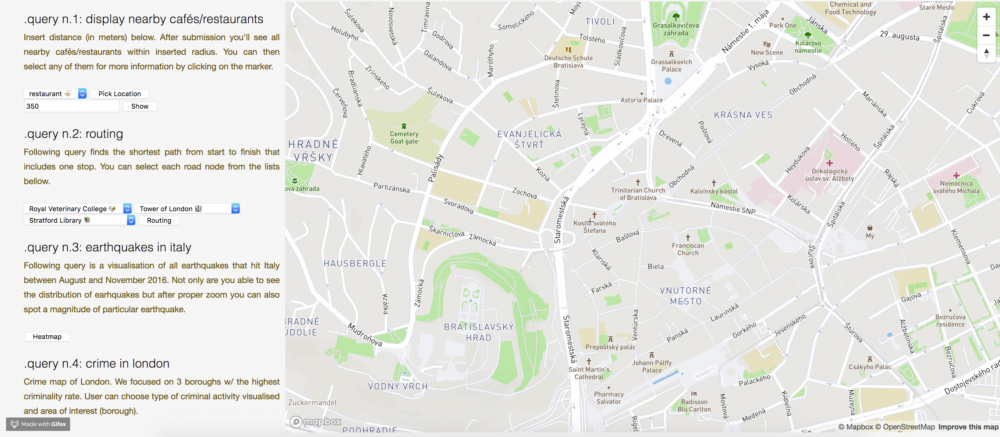

# General course assignment

Build a map-based application, which lets the user see geo-based data on a map and filter/search through it in a meaningfull way. Specify the details and build it in your language of choice. The application should have 3 components:

1. Custom-styled background map, ideally built with [mapbox](http://mapbox.com). Hard-core mode: you can also serve the map tiles yourself using [mapnik](http://mapnik.org/) or similar tool.
2. Local server with [PostGIS](http://postgis.net/) and an API layer that exposes data in a [geojson format](http://geojson.org/).
3. The user-facing application (web, android, ios, your choice..) which calls the API and lets the user see and navigate in the map and shows the geodata. You can (and should) use existing components, such as the Mapbox SDK, or [Leaflet](http://leafletjs.com/).

## Example projects

- Showing nearby landmarks as colored circles, each type of landmark has different circle color and the more interesting the landmark is, the bigger the circle. Landmarks are sorted in a sidebar by distance to the user. It is possible to filter only certain landmark types (e.g., castles).

- Showing bicykle roads on a map. The roads are color-coded based on the road difficulty. The user can see various lists which help her choose an appropriate road, e.g. roads that cross a river, roads that are nearby lakes, roads that pass through multiple countries, etc.

## Data sources

- [Open Street Maps](https://www.openstreetmap.org/)
- [GEOFABRIK](https://www.geofabrik.de/)

## My project


**Application description**: Web-based application demonstrating advanced geospatial queries (result visualisation included).

We focused on queries somehow related to everyday life in the big city:
1. Find all near-by cafés :coffee: and/or restaurants :ramen: (based  on current position or position chosen by user).
2. Find shortest path from dorm to work that includes chosen cafe (mornings are tough and cocaine illegal :pig_nose: ).
3. Earthquake heatmap of Italy (part of everyday life in Italy, sorta).
4. Criminality map of London :guardsman: - some interesting correlations (thug life in tha bloody UK 🇬🇧).
5. Find every bridge crossing River Thames :ship: located in London :pushpin: and calculate its length.

### List of usecases covered:

// other usecases may appear occasionally :bust_in_silhouette: :eyes: 


**List of datasets:** 

* [Italy's Earthquakes](https://www.kaggle.com/blackecho/italy-earthquakes) - data about the earthquakes that hit Italy 
between August and November 2016.
* [London Police Records](https://www.kaggle.com/sohier/london-police-records/) - complete snapshot of crime, outcome, 
and stop and search data, as held by the Home Office from late 2014 through mid 2017 for London, both the greater metro and the city.
 
**Technologies & tools used:**

* [PgRouting](https://pgrouting.org/) - additional layer on the top of PostGIS for routing 
* [Flask](http://flask.pocoo.org/) - backend
* JS, JQuery, AJAX, [Mapbox GL JS API](https://www.mapbox.com/mapbox-gl-js/api/) (v0.50.0) - frontend
* [osm2pgsql](https://github.com/openstreetmap/osm2pgsql) - import tool for loading OpenStreetMap data into PostgreSQL
* [osm2pgrouting](https://github.com/pgRouting/osm2pgrouting)- import tool for OpenStreetMap data to pgRouting database.

### Usecases
 
#### 1. Display nearby cafés



Insert distance (in meters). After submission you'll see all nearby cafés within inserted radius. 
You can then select any of them for more information by clicking on the marker.

**Query:**

```sql
with poi as (
    SELECT name, osm_id, way, "addr:street", "addr:housenumber",operator,website,outdoor_seating, internet_access,smoking,opening_hours FROM planet_osm_point
    where amenity = 'cafe'
    and ST_DWithin(st_transform(way,4326)::geography, ST_SetSRID(ST_MakePoint(lng, lat), 4326)::geography, radius)
)
SELECT jsonb_build_object(
  'type',     'FeatureCollection',
  'features', jsonb_agg(feature)
) from (
SELECT jsonb_build_object(
    'type',       'Feature',
    'id',         osm_id,
    'geometry',   ST_AsGeoJSON(ST_Transform(way,4326))::jsonb,
    'properties', jsonb_strip_nulls(jsonb_build_object(
   		'name', name,
    	'operator', operator,
    	'opening_hours', opening_hours,
    	'website', website,
    	'outdoor_seating', outdoor_seating,
    	'internet_access', internet_access,
    	'smoking', smoking,
    	'addr:street', "addr:street",
    	'addr:housenumber', "addr:housenumber",
    	'internet_access', internet_access
  ))
  ) AS feature
  FROM poi
  ) features;
``` 

#### 2. Route planner for a trip in London (routing w/ a middleman)


Following query finds the shortest path from start to finish that includes one stop. You can select each road node from 
the lists bellow. 

We implemented shortest path search w/ a middleman - final path includes not only  points A (start) and B (destination), 
but also point C, lying on the route somewhere. 

We used PostgreSQL extension PgRouting running on the top of PostGIS. PgRouting uses map as an directed/undirected graph 
and performs routing operations using known graph algorithms available as functions. We used Dijkstra's algorithm.

**Queries:**

We splitted query to two for readability:

1. Selecting points of interest - first we want to get start, middleman and destination.

```sql
SELECT jsonb_build_object(
    'type', 'FeatureCollection',
	'features', jsonb_agg(feature)
	  )
FROM (SELECT jsonb_build_object(
          'type', 'Feature',
		  'geometry', ST_AsGeoJSON(ST_Transform(way, 4326)) :: jsonb,
		  'properties', jsonb_strip_nulls(jsonb_build_object(
										'name', name,
										'vertex_id', vertex_id
										 ))
						  ) AS feature
	  FROM (select distinct ON (point.name) point.name,
										    st_transform(point.way, 4326) as way,
											vertices.id as vertex_id,
											point.osm_id
			  from planet_osm_point as point
				  JOIN ways_vertices_pgr as vertices ON (point.osm_id = vertices.osm_id)
				where (name) = 'src'
					or (name) = 'stop'
					or (name) = 'dst') inputs) features;
```


2. Path finding - here we perform path finding using PgRouting - POI selected above are used here.

```sql
select ST_AsGeoJSON(st_union((merged_route.the_geom)))
from (SELECT ways.the_geom
    from pgr_dijkstra('SELECT gid as id, source, target,
							 length as cost FROM ways',
												src_id,
		stop_id,
		directed := false) src_stop_dij
			 JOIN ways ON (src_stop_dij.edge = ways.gid)
union
SELECT ways.the_geom
from pgr_dijkstra('
                SELECT gid as id, source, target,
                        length as cost FROM ways',
									stop_id,
		dst_id,
		directed := false
		) stop_dst_dij
		JOIN ways ON (stop_dst_dij.edge = ways.gid)) merged_route;
```

#### 3. Earthquakes in Italy


Following query is a visualisation of all earthquakes that hit Italy between August and November 2016 (see List of 
datasets). Not only are you able to see the distribution of earhquakes but after proper zoom you can also spot a 
magnitude of particular earthquake.

Although query seems to be quite simple, visualisation looks pretty neat and because of that we decided to keep it here. 
We slightly cleaned our data (removed unnecessary columns).

**Query:**

```sql
SELECT jsonb_build_object(
  'type',     'FeatureCollection',
  'features', jsonb_agg(feature)
)
FROM (
  SELECT jsonb_build_object(
    'type',       'Feature',
    'geometry',   ST_AsGeoJSON(ST_Transform(geom,4326))::jsonb,
    'properties', jsonb_strip_nulls(jsonb_build_object(
   		'magnitude', magnitude

  ))
  ) AS feature
  FROM (
    SELECT magnitude,geom FROM italy
  ) inputs
) features
```

#### 4. Crime in London


Crime map of London (see List of datasets). We focused on 3 boroughs w/ the highest criminality rate:
      
1. London Borough of Camden
2. City of Westminster
3. London Borough of Lambeth

User can choose type of criminal activity visualised and area of interest (borough).

**Query:**

```sql
with borough as (select st_transform(way, 4326) as geom from planet_osm_polygon where name = 'borough')
SELECT jsonb_build_object(
				 'type', 'FeatureCollection',
				 'features', jsonb_agg(feature)
					 )
FROM (SELECT jsonb_build_object(
							 'type', 'Feature',
							 'geometry', ST_AsGeoJSON(ST_Transform(geom, 4326)) :: jsonb,
							 'properties', jsonb_strip_nulls(jsonb_build_object(
																								 'crime_type', crime_type,
																								 'crime_type_count', crime_type_count
																									 ))
								 ) AS feature
			FROM (SELECT crime_records.geom, crime_type, count(crime_type) as crime_type_count
						FROM crime_records
									 join borough on st_contains(borough.geom, st_transform(crime_records.geom, 4326))
						where crime_type = 'crime_type'
						group by crime_records.geom, crime_type) inputs) features;
```

#### 5. Bridges crossing River Thames


This query highlights all bridges crossing River Thames and computes each one's length. Name and length of particular 
bridge is visible after click.

We compute the length directly in our query (results aren't always perfect due to incompletion of OSM data used). 

**Query:**

```sql
with river_thames as (select st_union(way) as way from planet_osm_line where waterway = 'river'
																		 and name = 'River Thames')
SELECT jsonb_build_object(
    'type', 'FeatureCollection',
	'features', jsonb_agg(feature)
	)
FROM (SELECT jsonb_build_object(
	      'type', 'Feature',
		  'geometry', ST_AsGeoJSON(ST_Transform(geom, 4326)) :: jsonb,
		  'properties', jsonb_strip_nulls(jsonb_build_object(
											  'name', name,
											  'len', len
											  )
						  )
		  ) AS feature
    FROM (select (array_agg(line.way)) [ 1 ] as geom,
									 line.name,
									 (array_agg(st_length(st_transform(line.way, 4326) :: geography))) [ 1 ] as len
						from planet_osm_line line,
							river_thames
		  where st_intersects(line.way, river_thames.way)
		      and bridge = 'yes'
			  and lower(name) like '%bridge%'
			  and lower(name) not like '%railway%'
		  group by line.name) inputs) features;
```

### Performance

We analyzed performace and speed of our queries. Indexes were used only if cost difference was significant. Bellow are 
few queries along with cost before and after indexing. 

We used GIST indexes only. In case of PgRouting indexes were already created by osm2pgrouting import tool. 

Snippets below show only indexes that significantly improved performance, not all indexes analyzed.

```sql
CREATE INDEX if not exists gist_geom_crime_records
	ON crime_records
	USING GIST (st_transform(geom, 4326));
	
-- w/o index
-- Startup Cost: 2448581.93
-- Total Cost: 2448636.21

-- w/ index
-- Startup Cost: 48097.96
-- Total Cost: 48152.24

explain (format yaml, analyze true)

with borough as (select st_transform(way, 4326) as geom
								 from planet_osm_polygon
								 where name = 'London Borough of Lambeth')
SELECT crime_records.geom, count(crime_type) as crime_type_count
FROM crime_records
			 join borough on st_contains(borough.geom, st_transform(crime_records.geom, 4326))
group by crime_records.geom;
```

```sql
CREATE INDEX gist_geog_point
	ON planet_osm_point
	USING GIST (geography(st_transform(way, 4326)));

-- w/o index 	
-- Startup Cost: 0.00
-- Total Cost: 32853.76

-- w/ index
-- Startup Cost: 737.51
-- Total Cost: 8113.15

explain (format yaml, analyze true)
SELECT name,
			 osm_id,
			 way,
			 "addr:street",
			 "addr:housenumber",
			 operator,
			 website,
			 outdoor_seating,
			 internet_access,
			 smoking,
			 opening_hours
FROM planet_osm_point
where amenity = 'cafe'
	and ST_DWithin(st_transform(way, 4326) :: geography,
								 ST_SetSRID(ST_MakePoint(17.1061116, 48.14498859990289), 4326) :: geography,
								 5000);
```

